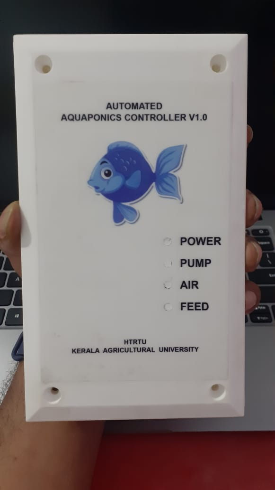
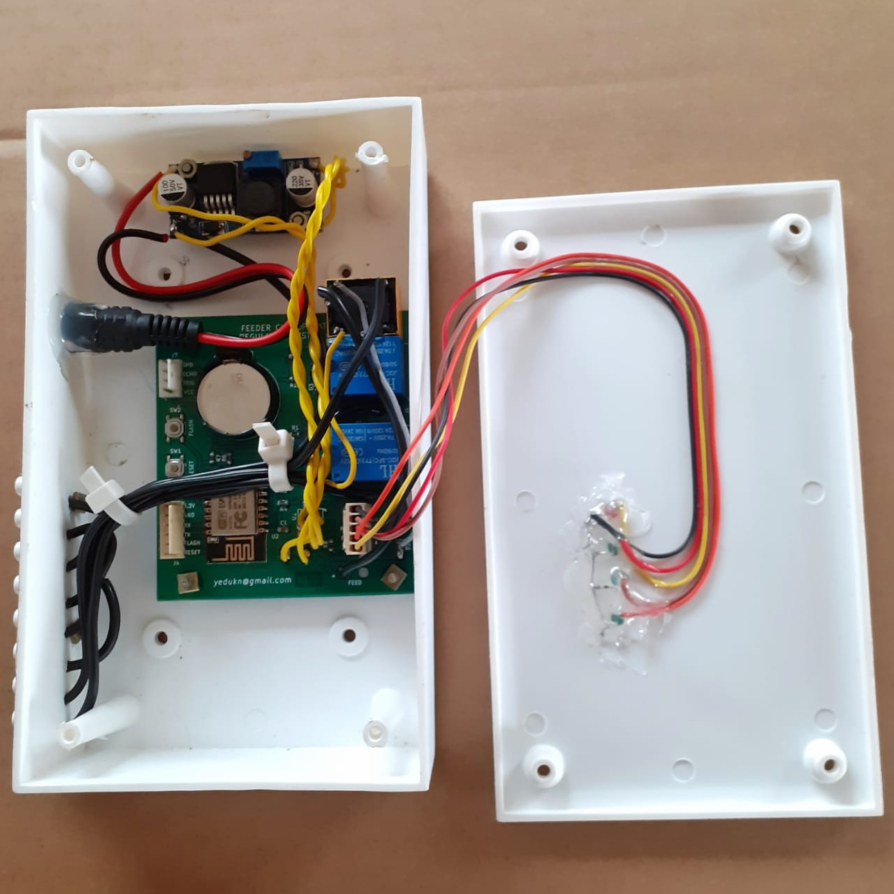
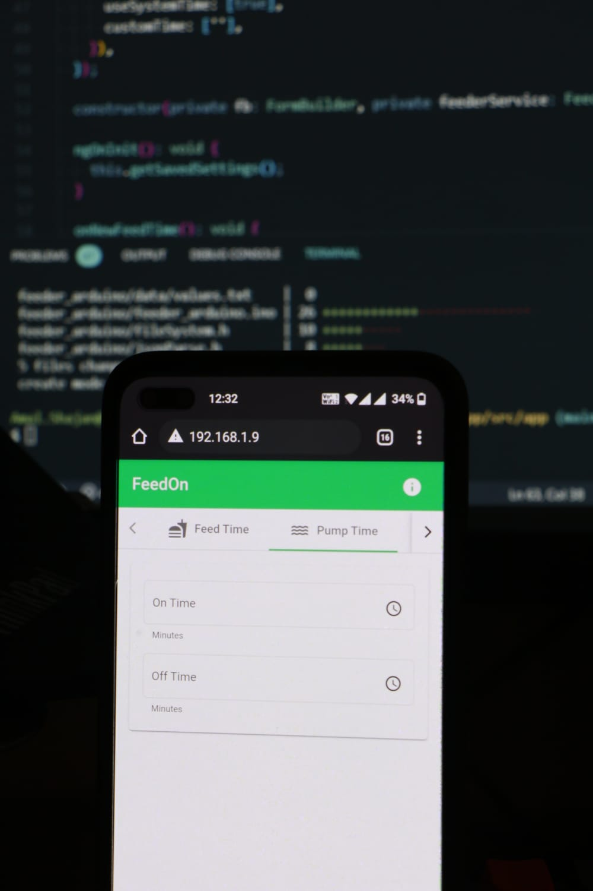

# Automated Fish Feeder With Pump Controller

Device Working Video:

App Working Video:

- Design and development: [@yedukn](https://github.com/yedu-kn)
- Web app design and development: [@b45i](https://github.com/B45i)

This product was developed for Kerala Agricultural University as per their specifications and requirements.

They've to feed the fish in their pond without manpower and on holidays too.

They also need to power the Air Pump for a few hours at night to reduce the power consumption further.
That feature is also included in this device.

Some of their aquaponics systems work by turning the water pump ON and OFF at regular intervals to maintain the bed water levels, unlike the traditional syphon method.
This reduces the power consumption considerably and avoids the clogging and failure of the system due to the unmaintained siphons.

They also need to power the Air Pump for a few hours at night to reduce the power consumption further.
That feature is also included in this device.

This device works on `ESP8266` SoC and EM Relays.

When the device is turned ON the ESP8266 creates a hotspot.
Connect any smartphone or computer to the hotspot and enter the default IP address (`192.168.4.1`) of the device in any browser (`http://192.168.4.1/`).

This will load a web app with the default values or previously uploaded values.
We use this app to upload our desired timings and settings.
This web page is developed using `Angular` and `Angular Material`.
Once the values are entered on the page, click the Upload button.
This will update the JSON string in the FLASH using SPIFF.
Since these values are stored in FLASH, it's non-volatile and the web page fetches the values back while we connect to the network next time.
So we just need to update the previous values instead of entering the whole values again.

And the importance / beauty of this type of device from conventional timers and controllers is,we need very little hardware.

Normally a timer / controller will have an LCD, multiple buttons, rotary encoders etc.
But nowadays most have a smartphone with them where we'll get all these components virtually.
Also, the User Interface and User Experience is much good.
Normally setting these values in a controller using buttons is a tedious task to all.

So by making use of the web app we reduced the component cost, PCB cost, size of the product and enhanced the UI/UX, increased the manufacturability, life span and reparability of the product

App Demo: [https://fish-feeder-app.vercel.app/](https://fish-feeder-app.vercel.app/)
